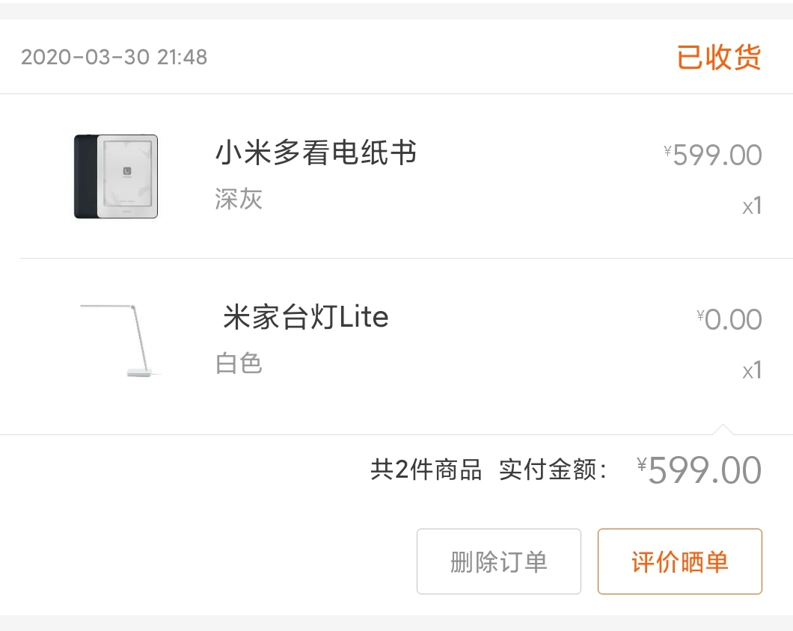

# 小米多看电纸书开箱指南（秒装微信电纸书）

参考：

桌面 github 地址：

[Kagami-src/MiReaderLauncher: A simple Launcher for MiReader](https://github.com/Kagami-src/MiReaderLauncher)

桌面 APP 发行版

https://post.smzdm.com/p/ax0r3gxd/

参考攻略：

https://post.smzdm.com/p/ar080vrx/


作为微信读书重度用户（每周读书肯定能换3天阅读卡，听书每天2小时），我想买个电纸书阅读器保护我的眼睛。（眼睛干，难受）

小米上下单599，还送了79的台灯一只。

https://m.mi.com/commodity/detail/1194600013?client_id=180100031058&masid=20029.00001





## 开机


### 进入开发者模式


手指在屏幕上向下滑动，有个菜单出来，选择**设置**->**关于**，然后请狂按**版本号**，直到打开开发者模式。


### Mac 安装 adb

```bash
$ brew cask install android-sdk
Warning: Cask 'android-sdk' is already installed.

To re-install android-sdk, run:
  brew cask reinstall android-sdk
```

### 下载微信读书和 MiLauncher

1. 大神自制的桌面：[MiReaderLauncher1.0alpha.apk](https://kagamiapk.nos-eastchina1.126.net/MiReaderLauncher1.0alpha.apk)

2. 微信读书墨水屏：[https://ink.qq.com](https://go.smzdm.com/af0c0df95873694b/ca_bb_yc_163_70459511_10335_0_179_0)

### 安装 app

连接 usb 到 MacBook

```bash
adb install -r weread_android_1.2.0_10141054_900.apk
adb install -r MiReaderLauncher1.0alpha.apk
```

### 按开关重启 MiReader

### 选择 MiLauncher 启动

搞定了，打开微信读书吧。


最近微信读书居然开始收费了，我辛苦积攒了800天的无限卡啊，我还是用回起点吧，再见。

```bash
adb  install -r ~/Downloads/QDReader.apk
```


