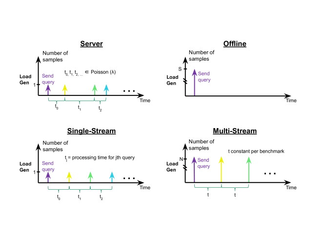

# MLPerf学习笔记 - MLPerf LoadGen 测试场景

英文来源：https://mlperf.github.io/inference/loadgen/group__LoadgenAPITestSettings.html#ga7fedeb2084e2f956c6386ffce01d2016

我最近在学习MLPerf Inference基准。这是一个用于机器学习（其实大部分模型是深度学习）的性能测试基准。



MLPerf Inference一共有五种测试场景。其中MultiStreamFree （无约束版本）不是官方场景。

- SingleStream

  - 发出包含了单个样本的查询。

  - 仅在前一个查询完成后才发出下一个查询。

  - 两次查询之间的LoadGen内部的延迟不包括在延迟结果中。

  - **最终的性能结果:** 按照百分比显示的茶轩延迟结果.

  - **例子**:

    ```
    90th percentile latency (ns) : 13715612806
    Result is : VALID
      Min duration satisfied : Yes
      Min queries satisfied : Yes
    
    ================================================
    Additional Stats
    ================================================
    QPS w/ loadgen overhead         : 0.07
    QPS w/o loadgen overhead        : 0.07
    
    Min latency (ns)                : 13705150160
    Max latency (ns)                : 13721821587
    Mean latency (ns)               : 13711405808
    50.00 percentile latency (ns)   : 13711277377
    90.00 percentile latency (ns)   : 13715612806
    95.00 percentile latency (ns)   : 13716512077
    97.00 percentile latency (ns)   : 13717889420
    99.00 percentile latency (ns)   : 13721821587
    99.90 percentile latency (ns)   : 13721821587
    ```

    

- MultiStream

  - 尝试以统一速率发出包含N个样本的查询

    - N 通过 [multi_stream_samples_per_query ](https://mlperf.github.io/inference/loadgen/structmlperf_1_1TestSettings.html#aa6f21cb8169bc0eb80214cfd9ac46663) 设置。
    - 速率通过 [multi_stream_target_qps ](https://mlperf.github.io/inference/loadgen/structmlperf_1_1TestSettings.html#acb0c321e3442ee6bd241cf24f5088205) 设置.

  - 如果SUT处理相对处理周期来说落在后面太多，则loadgen将跳过发送一个间隔。

  - 默认情况下，一次只能有一个查询未完成。

  - 保证每个查询中的样本们在[QuerySampleLibrary](https://mlperf.github.io/inference/loadgen/classmlperf_1_1QuerySampleLibrary.html)中加载的顺序都是[连续的](https://mlperf.github.io/inference/loadgen/classmlperf_1_1QuerySampleLibrary.html)。

  - 针对每个查询和每个样本跟踪和报告延迟。

  - - 查询的等待时间是所有样本的最大等待时间，包括loadgen中的任何跨线程通信。

      - 如果loadgen因为无法检测到所有样本均已及时完成而不得不跳过一个时间间隔，则该查询将不被视为满足延迟约束。
      - 这是很公平的，因为loadgen跳过时间间隔会降低SUT的压力，这应该在延迟百分比中产生负面影响。
      - 最后一个查询是特殊情况，因为没有后续查询要延迟。对于最后一个查询，使用没有跨线程通信的查询延迟。

    - 最终的性能结果是：

      如果qer查询延迟的百分位数在给定阈值以下，则通过。否则失败。

      - 延迟约束由函数（[multi_stream_max_async_queries](https://mlperf.github.io/inference/loadgen/structmlperf_1_1TestSettings.html#adbdd98db3a881d3720623bfb03bd5bfa) / [multi_stream_target_qps](https://mlperf.github.io/inference/loadgen/structmlperf_1_1TestSettings.html#acb0c321e3442ee6bd241cf24f5088205)）指定。

- MultiStreamFree （无约束版本）

  - 行为类似于MultiStream，不同之处在于：

    - 最多允许N个异步查询，其中N仅受等待时间目标限制。
    - 当第N个最旧查询完成时，以可变速率发出查询。

  - 这不是官方的MLPerf方案，而是为了评估和测试目的而进行维护

  - 和MultiStream相比，没有频率量化，这可以使结果反映出较小的性能改进。

  - 最终的性能结果是：

    如果每个查询延迟的百分位数在给定阈值以下，则通过。否则失败。

    - 延迟约束由[multi_stream_target_latency_ns](https://mlperf.github.io/inference/loadgen/structmlperf_1_1TestSettings.html#a14cc63f023c5af26eb75c10fb82b4e47)指定。

- Server

  - 使用单个样本发送查询。
  - 查询使用随机的泊松分布（非均匀）到达率，平均时达到目标QPS。
  - 只要满足延迟限制，未完成查询的数量就没有限制。
  - 最终的性能结果是：**如果延迟的百分位数在给定阈值以下，则通过。否则失败。
    - 阈值由[server_target_latency_ns](https://mlperf.github.io/inference/loadgen/structmlperf_1_1TestSettings.html#abed28cce618cb926ca94971b4a9c0171)指定。

- Offline

  - 在单个查询中将所有N个样本一次性发送到SUT。
  - 保证查询的样本在[QuerySampleLibrary](https://mlperf.github.io/inference/loadgen/classmlperf_1_1QuerySampleLibrary.html)中加载的顺序是连续的。
  - **最终的性能结果是：**每秒处理的样本数。

