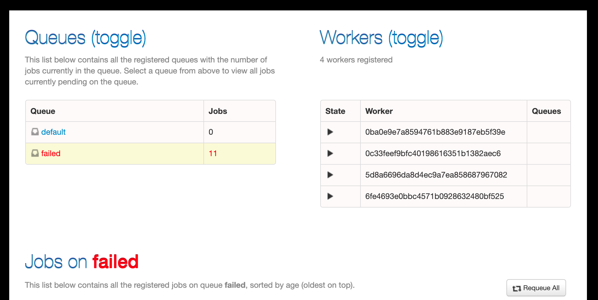

# 使用Python RQ的思考

使用了 RQ 一段时间，对 RQ有了一定的了解，我们来总结下使用这小工具的心得吧。


从他的官方网站，我们可以看到这样一句话，RQ 是个简单的 Python 库，可以让任务排队，并交给后台的工人依次处理。

`RQ (*Redis Queue*) is a simple Python library for queueing jobs and processing them in the background with workers. It is backed by Redis and it is designed to have a low barrier to entry.`

***优点：***

- 他的确非常非常的简单，几乎稍微看一下就能上手。
- 部署也很简单，启动个 redis 容器，安装好 rq库就好了。
- 可以做简单的链式处理，可以通过 dependency_on设置前导任务。
- 所以，如果你只是想让任务排队执行或者想要并行处理任务，（这比你自己 fork进程或者线程，要来得干净清楚的多），就用 RQ吧

***使用时可能遇到的问题：***

- 默认超时时间是3分钟。需要自己想好超时的时间, 不能设置个无穷大。当然，你可以自己设置9999年。
- 如果任务有强制的先后顺序要求，可以设置enqueue函数depends_on参数来决定先后关系。depends_on可以是一个 job_id, 也可以是个数组。
- 安装RQ Dashboard来监控 RQ，这比命令行的那个稍微强一点。但是，还是看不到所有的 registry。

```bash
pip3 install rq-dashboard
```



- 如果你机器上有多个 python, 如果你要使用 rq worker来启动工人进程，请正确设置 PATH 和 PYTHONPATH 环境变量。

  - PATH 中应该包含你要用到 python命令的目录，比如

    ```bash
    export PATH=~/code/my_projet/venv/bin:$PATH
    ```

    

  - Python Path 中应该包含你要用到任务代码的模块根目录， 比如你的代码模块是 cqy.tasks，代码在~/code/my_project/cqy/tasks中，那么 PYTHONPATH 应该指向~/code/my_project

    ```bash
    export PYTHONPATH=~/code/my_project:$PYTHONPATH
    ```

    